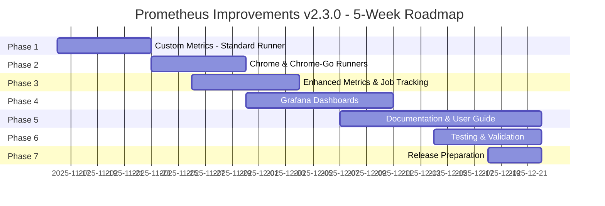
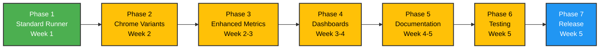

# Prometheus Improvements - Implementation Roadmap

**Feature:** Prometheus Metrics Endpoint & Grafana Dashboards  
**Target Release:** v2.3.0  
**Timeline:** 5 Weeks (November 16, 2025 - December 21, 2025)  
**Status:** 🚧 In Progress  
**Project Board:** [GitHub Project #5](https://github.com/users/GrammaTonic/projects/5)

---

## 📅 Timeline Overview



---

## 🗓️ Week-by-Week Breakdown

### **Week 1: November 16-23, 2025**
**Focus:** Foundation - Standard Runner Metrics Endpoint

```
┌─────────────────────────────────────────────────────────────┐
│ Week 1: Foundation                                          │
├─────────────────────────────────────────────────────────────┤
│ Phase 1: Custom Metrics Endpoint - Standard Runner         │
│ Status: 🚧 IN PROGRESS                                      │
│ Issue: #1052                                                │
│                                                             │
│ Mon-Tue (Nov 16-17): Metrics Infrastructure                │
│   ✓ TASK-001: Create HTTP server script (netcat)           │
│   ✓ TASK-002: Create metrics collector script              │
│   ✓ TASK-003: Initialize job logging                       │
│                                                             │
│ Wed-Thu (Nov 18-19): Integration                           │
│   □ TASK-004: Integrate into entrypoint.sh                 │
│   □ TASK-005: Update Dockerfile (EXPOSE 9091)              │
│   □ TASK-006: Update docker-compose.production.yml         │
│   □ TASK-007: Add environment variables                    │
│                                                             │
│ Fri (Nov 20): Build & Deploy                               │
│   □ TASK-008: Build runner image                           │
│   □ TASK-009: Deploy test runner                           │
│                                                             │
│ Sat-Sun (Nov 21-22): Validation                            │
│   □ TASK-010: Validate metrics endpoint                    │
│   □ TASK-011: Verify update interval                       │
│   □ TASK-012: Test job logging                             │
│                                                             │
│ Deliverables:                                              │
│   • Metrics endpoint on port 9091 (standard runner)        │
│   • Job tracking logs                                       │
│   • Basic metrics: status, jobs, uptime                     │
└─────────────────────────────────────────────────────────────┘
```

**Milestone:** ✅ Standard runner exposing metrics on port 9091

---

### **Week 2: November 23-30, 2025**
**Focus:** Expansion - Chrome Variants & Enhanced Metrics

```
┌─────────────────────────────────────────────────────────────┐
│ Week 2: Expansion                                           │
├─────────────────────────────────────────────────────────────┤
│ Phase 2: Chrome & Chrome-Go Runners                        │
│ Status: ⏳ PLANNED                                          │
│ Issue: #1053                                               │
│                                                             │
│ Mon-Tue (Nov 23-24): Chrome Runner                         │
│   □ TASK-013: Integrate metrics in entrypoint-chrome.sh    │
│   □ TASK-014: Update Dockerfile.chrome                     │
│   □ TASK-016: Update docker-compose.chrome.yml             │
│   □ TASK-018: Add environment variables                    │
│   □ TASK-020: Build Chrome image                           │
│   □ TASK-022: Deploy Chrome runner                         │
│   □ TASK-024: Validate Chrome metrics (port 9092)          │
│                                                             │
│ Wed-Thu (Nov 25-26): Chrome-Go Runner                      │
│   □ TASK-015: Update Dockerfile.chrome-go                  │
│   □ TASK-017: Update docker-compose.chrome-go.yml          │
│   □ TASK-019: Add environment variables                    │
│   □ TASK-021: Build Chrome-Go image                        │
│   □ TASK-023: Deploy Chrome-Go runner                      │
│   □ TASK-025: Validate Chrome-Go metrics (port 9093)       │
│   □ TASK-026: Test concurrent multi-runner deployment      │
│                                                             │
├─────────────────────────────────────────────────────────────┤
│ Phase 3: Enhanced Metrics & Job Tracking (STARTS)          │
│ Status: ⏳ PLANNED                                          │
│ Issue: #1054                                               │
│                                                             │
│ Fri-Sun (Nov 27-29): Job Duration Tracking                 │
│   □ TASK-027: Extend job log format to CSV                 │
│   □ TASK-028: Implement job timing via log parsing         │
│   □ TASK-029: Add duration histogram metrics               │
│   □ TASK-030: Add queue time metric                        │
│                                                             │
│ Deliverables:                                              │
│   • All 3 runner types with metrics endpoints              │
│   • Unique ports: 9091, 9092, 9093                         │
│   • Enhanced job duration tracking started                  │
└─────────────────────────────────────────────────────────────┘
```

**Milestones:**  
✅ Chrome runner with metrics (port 9092)  
✅ Chrome-Go runner with metrics (port 9093)  
🔄 Job duration tracking initiated

---

### **Week 3: November 30 - December 7, 2025**
**Focus:** Analytics - DORA Metrics & Dashboard Creation

```
┌─────────────────────────────────────────────────────────────┐
│ Week 3: Analytics                                           │
├─────────────────────────────────────────────────────────────┤
│ Phase 3: Enhanced Metrics (COMPLETION)                     │
│ Status: ⏳ PLANNED                                          │
│ Issue: #1054                                               │
│                                                             │
│ Mon-Tue (Nov 30-Dec 1): Cache Metrics                      │
│   □ TASK-031: Implement cache hit rate tracking            │
│   □ TASK-032: Add cache metrics (buildkit, apt, npm)       │
│   □ TASK-033: Update collector to read cache logs          │
│                                                             │
│ Wed (Dec 2): Testing & Documentation                       │
│   □ TASK-034: Test job duration with workflows             │
│   □ TASK-035: Validate cache metrics                       │
│   □ TASK-036: Document job log format                      │
│                                                             │
├─────────────────────────────────────────────────────────────┤
│ Phase 4: Grafana Dashboards (STARTS)                       │
│ Status: ⏳ PLANNED                                          │
│ Issue: #1055                                               │
│                                                             │
│ Thu-Fri (Dec 3-4): Dashboard 1 & 2                         │
│   □ TASK-037: Create runner-overview.json                  │
│   □ TASK-038: Configure dashboard variables                │
│   □ TASK-039: Create dora-metrics.json                     │
│                                                             │
│ Sat-Sun (Dec 5-6): Dashboard 3 & 4                         │
│   □ TASK-040: Create performance-trends.json               │
│   □ TASK-041: Create job-analysis.json                     │
│   □ TASK-042: Add dashboard metadata                       │
│                                                             │
│ Deliverables:                                              │
│   • Complete metrics collection (job duration + cache)      │
│   • DORA metrics calculable                                │
│   • 4 Grafana dashboards (initial versions)                │
└─────────────────────────────────────────────────────────────┘
```

**Milestones:**  
✅ Full metrics suite (jobs, duration, cache, DORA)  
✅ 4 Grafana dashboards created

---

### **Week 4: December 7-14, 2025**
**Focus:** Polish - Dashboard Refinement & Documentation

```
┌─────────────────────────────────────────────────────────────┐
│ Week 4: Polish                                              │
├─────────────────────────────────────────────────────────────┤
│ Phase 4: Grafana Dashboards (COMPLETION)                   │
│ Status: ⏳ PLANNED                                          │
│ Issue: #1055                                               │
│                                                             │
│ Mon-Tue (Dec 7-8): Dashboard Testing                       │
│   □ TASK-043: Test dashboards with Prometheus              │
│   □ TASK-044: Capture screenshots                          │
│   □ TASK-045: Export final JSON files                      │
│   □ TASK-046: Validate query performance (<2s)             │
│                                                             │
├─────────────────────────────────────────────────────────────┤
│ Phase 5: Documentation & User Guide (STARTS)               │
│ Status: ⏳ PLANNED                                          │
│ Issue: #1056                                               │
│                                                             │
│ Wed-Thu (Dec 9-10): Setup & Usage Guides                   │
│   □ TASK-047: Create PROMETHEUS_SETUP.md                   │
│   □ TASK-048: Create PROMETHEUS_USAGE.md                   │
│   □ TASK-049: Create PROMETHEUS_TROUBLESHOOTING.md         │
│                                                             │
│ Fri-Sat (Dec 11-12): Architecture & Reference              │
│   □ TASK-050: Create PROMETHEUS_ARCHITECTURE.md            │
│   □ TASK-054: Create PROMETHEUS_METRICS_REFERENCE.md       │
│   □ TASK-056: Create PROMETHEUS_QUICKSTART.md              │
│                                                             │
│ Sun (Dec 13): Integration & Examples                       │
│   □ TASK-051: Update README.md (Monitoring section)        │
│   □ TASK-052: Update docs/README.md                        │
│   □ TASK-053: Create prometheus-scrape-example.yml         │
│   □ TASK-055: Update docs/API.md (if applicable)           │
│                                                             │
│ Deliverables:                                              │
│   • Production-ready Grafana dashboards                     │
│   • Complete documentation suite (6 files)                  │
│   • Example configurations                                  │
└─────────────────────────────────────────────────────────────┘
```

**Milestones:**  
✅ Dashboards finalized with screenshots  
✅ Complete documentation suite

---

### **Week 5: December 14-21, 2025**
**Focus:** Quality - Testing, Validation & Release

```
┌─────────────────────────────────────────────────────────────┐
│ Week 5: Quality & Release                                   │
├─────────────────────────────────────────────────────────────┤
│ Phase 6: Testing & Validation                              │
│ Status: ⏳ PLANNED                                          │
│ Issue: #1057                                               │
│                                                             │
│ Mon-Tue (Dec 14-15): Test Creation                         │
│   □ TASK-057: Create test-metrics-endpoint.sh              │
│   □ TASK-058: Create test-metrics-performance.sh           │
│   □ TASK-069: Update tests/README.md                       │
│                                                             │
│ Wed-Thu (Dec 16-17): Load Testing                          │
│   □ TASK-059: Test standard runner (10 concurrent jobs)    │
│   □ TASK-060: Test Chrome runner (5 browser jobs)          │
│   □ TASK-061: Test Chrome-Go runner (5 Go+browser jobs)    │
│   □ TASK-062: Validate metrics persistence (restart test)  │
│   □ TASK-063: Test scaling (5 concurrent runners)          │
│                                                             │
│ Fri (Dec 18): Quality Assurance                            │
│   □ TASK-064: Measure storage growth (7 days)              │
│   □ TASK-065: Validate Grafana dashboards                  │
│   □ TASK-066: Benchmark query performance                  │
│   □ TASK-067: Security scan (no sensitive data)            │
│   □ TASK-068: Documentation review (clean install)         │
│   □ TASK-070: Add metrics tests to CI/CD                   │
│                                                             │
├─────────────────────────────────────────────────────────────┤
│ Phase 7: Release Preparation                               │
│ Status: ⏳ PLANNED                                          │
│ Issue: #1058                                               │
│                                                             │
│ Sat (Dec 19): Release Documentation                        │
│   □ TASK-071: Create v2.3.0-prometheus-metrics.md          │
│   □ TASK-072: Update VERSION file to 2.3.0                 │
│   □ TASK-080: Update README changelog                      │
│                                                             │
│ Sun-Mon (Dec 20-21): PR & Release                          │
│   □ TASK-073: Create PR to develop branch                  │
│   □ TASK-074: Address PR review comments                   │
│   □ TASK-075: Merge PR with squash merge                   │
│   □ TASK-076: Perform back-sync (develop ← main)           │
│   □ TASK-077: Tag release v2.3.0                           │
│   □ TASK-078: Push tag to origin                           │
│   □ TASK-079: Create GitHub release with dashboards        │
│                                                             │
│ Deliverables:                                              │
│   • Complete test suite (integration + performance)         │
│   • Performance validated (<1% CPU, <50MB RAM)             │
│   • v2.3.0 release published                               │
│   • Feature merged to main branch                          │
└─────────────────────────────────────────────────────────────┘
```

**Milestones:**  
✅ All tests passing  
✅ Performance validated  
🎉 **v2.3.0 RELEASED!**

---

## 📊 Phase Dependencies & Critical Path



**Legend:**
- 🟢 **Green:** In Progress
- 🟡 **Yellow:** Planned
- 🔵 **Blue:** Release Phase

---

## 🎯 Key Deliverables by Week

| Week | Deliverables | Status |
|------|-------------|--------|
| **Week 1** | • Metrics endpoint (standard runner)<br/>• Job logging infrastructure<br/>• Port 9091 exposed | 🚧 In Progress |
| **Week 2** | • Chrome runner metrics (port 9092)<br/>• Chrome-Go runner metrics (port 9093)<br/>• Job duration tracking | ⏳ Planned |
| **Week 3** | • Cache hit rate metrics<br/>• DORA metrics calculable<br/>• 4 Grafana dashboards | ⏳ Planned |
| **Week 4** | • Dashboard finalization<br/>• 6 documentation files<br/>• Setup examples | ⏳ Planned |
| **Week 5** | • Test suite complete<br/>• Performance validated<br/>• **v2.3.0 Release** 🎉 | ⏳ Planned |

---

## 📈 Progress Tracking

### Overall Progress

```
┌────────────────────────────────────────────────────────┐
│ Prometheus Improvements v2.3.0 Progress               │
├────────────────────────────────────────────────────────┤
│                                                        │
│ Phase 1 ████░░░░░░░░░░░░░░░░░░░  15% (2/12 tasks)    │
│ Phase 2 ░░░░░░░░░░░░░░░░░░░░░░   0%  (0/14 tasks)    │
│ Phase 3 ░░░░░░░░░░░░░░░░░░░░░░   0%  (0/10 tasks)    │
│ Phase 4 ░░░░░░░░░░░░░░░░░░░░░░   0%  (0/10 tasks)    │
│ Phase 5 ░░░░░░░░░░░░░░░░░░░░░░   0%  (0/10 tasks)    │
│ Phase 6 ░░░░░░░░░░░░░░░░░░░░░░   0%  (0/14 tasks)    │
│ Phase 7 ░░░░░░░░░░░░░░░░░░░░░░   0%  (0/10 tasks)    │
│                                                        │
│ TOTAL   ██░░░░░░░░░░░░░░░░░░░░   2.5% (2/80 tasks)   │
│                                                        │
└────────────────────────────────────────────────────────┘
```

### Tasks by Status

- ✅ **Completed:** 2 tasks (2.5%)
- 🚧 **In Progress:** 10 tasks (12.5%)
- ⏳ **Planned:** 68 tasks (85%)
- **Total:** 80 tasks

---

## 🚀 Quick Links

- **📋 Project Board:** [GitHub Project #5](https://github.com/users/GrammaTonic/projects/5)
- **📖 Implementation Plan:** `/plan/feature-prometheus-monitoring-1.md`
- **📄 Feature Spec:** `/docs/features/PROMETHEUS_IMPROVEMENTS.md`
- **🔗 Related Issues:** [#1052](https://github.com/GrammaTonic/github-runner/issues/1052), [#1053](https://github.com/GrammaTonic/github-runner/issues/1053), [#1054](https://github.com/GrammaTonic/github-runner/issues/1054), [#1055](https://github.com/GrammaTonic/github-runner/issues/1055), [#1056](https://github.com/GrammaTonic/github-runner/issues/1056), [#1057](https://github.com/GrammaTonic/github-runner/issues/1057), [#1058](https://github.com/GrammaTonic/github-runner/issues/1058)

---

## ⚠️ Critical Success Factors

### Week 1 (Foundation)
- ✅ Metrics endpoint working reliably
- ✅ 30-second update interval achieved
- ✅ <1% CPU overhead validated

### Week 2 (Expansion)
- ✅ All runner types with metrics
- ✅ Multi-runner deployment successful
- ✅ Job duration tracking accurate

### Week 3 (Analytics)
- ✅ DORA metrics calculable
- ✅ Cache metrics accurate
- ✅ Dashboards display data correctly

### Week 4 (Polish)
- ✅ Dashboard queries <2s
- ✅ Documentation complete and clear
- ✅ Example configs work out-of-box

### Week 5 (Release)
- ✅ All tests passing
- ✅ Performance requirements met
- ✅ Security scan clean
- ✅ v2.3.0 released on schedule

---

## 📞 Escalation Path

If any phase is blocked or delayed:

1. **Minor delays (<2 days):** Adjust task priorities within phase
2. **Moderate delays (2-4 days):** Compress subsequent phases by parallelizing tasks
3. **Major delays (>4 days):** Reassess scope, potentially defer Phase 6 tests to post-release

**Project Owner:** Development Team  
**Review Cadence:** Weekly on Fridays  
**Next Review:** November 22, 2025

---

**Last Updated:** November 16, 2025  
**Version:** 1.0  
**Status:** 🚧 In Progress (Week 1, Phase 1)
